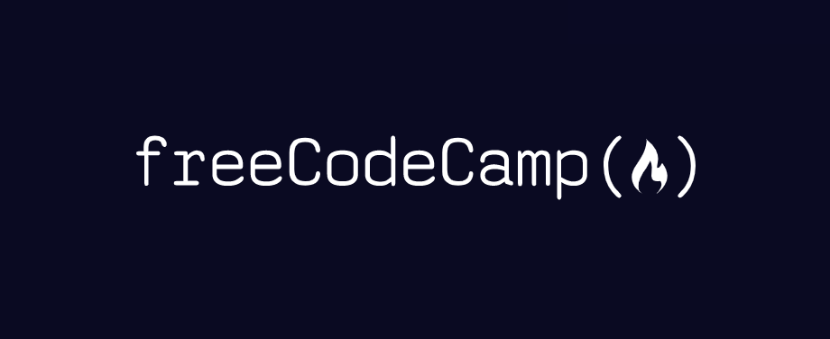

<h1 align="center">
 
  
 
 
Projetos da plataforma freeCodeCamp
</h1>

Repositório para apresentar os projetos desenvolvidos no curso.

  
  
  

## Responsive Web Design Certification

### :computer: Lista de Projetos
- [Tribute Page](projects/tribute-page)
- [Survey Form](projects/survey-form)
- [Product Landing Page](projects/product-landing-page)
- [Technical Documentation Page](projects/technical-documentation-page)
- [Personal Portfolio Webpage](projects/personal-portfolio-webpage)

## :memo: Licença

Esse estudo está sob a licença MIT. Veja o arquivo [LICENSE](/LICENSE) para mais detalhes.
